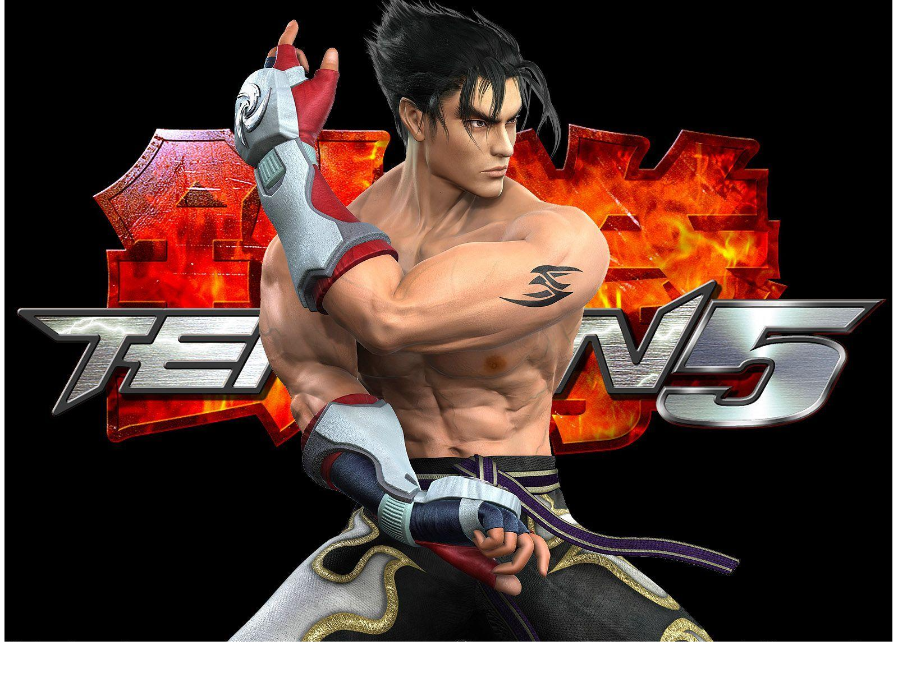
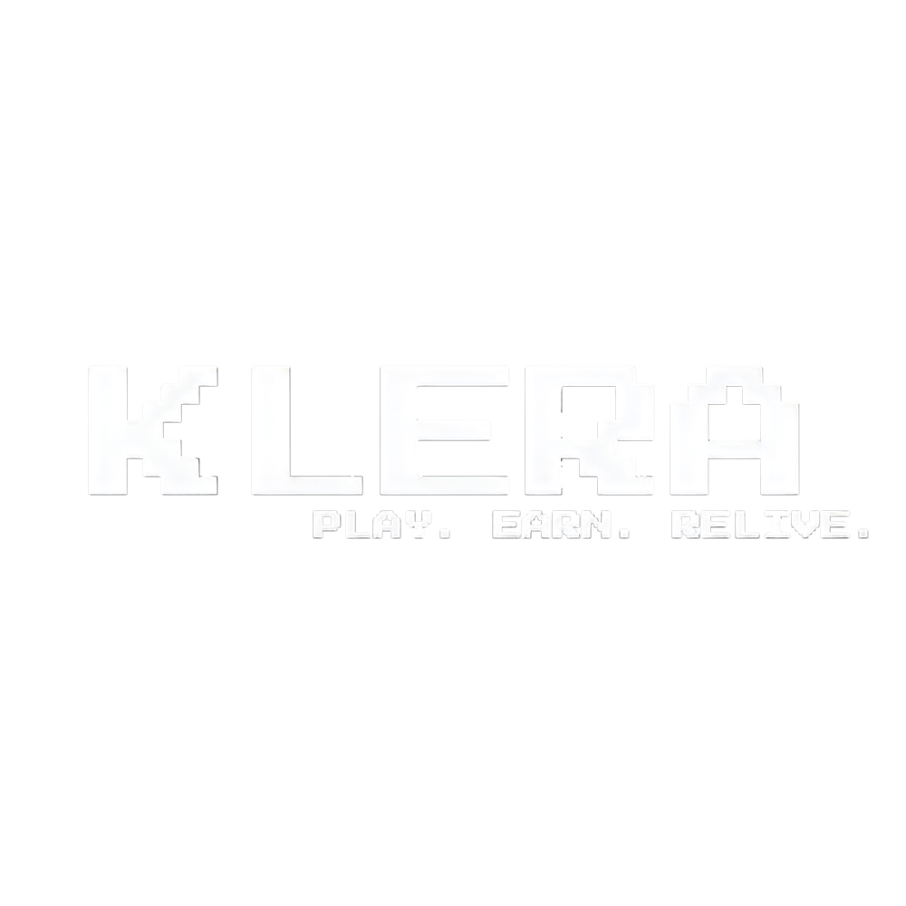

# Klera




Welcome to **Klera**, a revolutionary platform where gaming meets financial innovation. Use your wallet to buy coins, sell them for money, and immerse yourself in exciting single-player and 1v1 games like Tekken 3 and Super Mario.

## Live Website
Explore the live experience: [Klera Website](https://klera.netlify.app/)

---

## Getting Started
Follow these steps to set up and run the project locally:

### Prerequisites
Ensure you have the following installed:
- [Node.js](https://nodejs.org/) (Latest LTS version recommended)
- [Git](https://git-scm.com/)

### Installation Guide

1. Clone the repository:
   ```bash
   git clone https://github.com/Sruushtii/Klera.git
   ```

2. Navigate into the project directory:
   ```bash
   cd Klera
   ```

3. Install the required dependencies:
   ```bash
   npm install
   ```

4. Start the development server:
   ```bash
   npm run dev
   ```

### Accessing the Application
After running the development server, open your browser and visit `http://localhost:5173`.

---

## Project Structure

```text
Klera/
├── public/                 # Static assets (images, videos, logos)
├── src/
│   ├── components/         # Reusable UI components (Header, Hero, etc.)
│   ├── pages/              # Application views (Login, Wallet)
│   ├── games/              # React components for individual games
│   ├── utils/              # Helper functions and validations
│   ├── firebaseConfig.js   # Firebase initialization
│   ├── App.jsx             # Main App entry
│   └── main.jsx            # Application root
├── package.json            # Dependencies and scripts
└── vite.config.js          # Vite build configuration
```

---

## Features

- **Dynamic Wallet System**: Buy coins to play games or sell them for real money.
- **Gaming Modes**: Play single-player retro classics or compete 1v1.
- **Integrated Authentication**: Secure login and signup via Firebase.

---

## Built With

- **React.js** - Frontend User Interface
- **Vite** - Lightning Fast Build Tool
- **Tailwind CSS** - Utility-first CSS styling
- **Firebase** - Backend services & Auth
- **Netlify** - Web app hosting

---

## Contact
For any questions or suggestions, feel free to reach out:
- **Name:** Srushtiiii
- **Email:** [kumbharsrusthi.01@gmail.com](mailto:kumbharsrusthi.01@gmail.com)

---



Enjoy Gaming!
